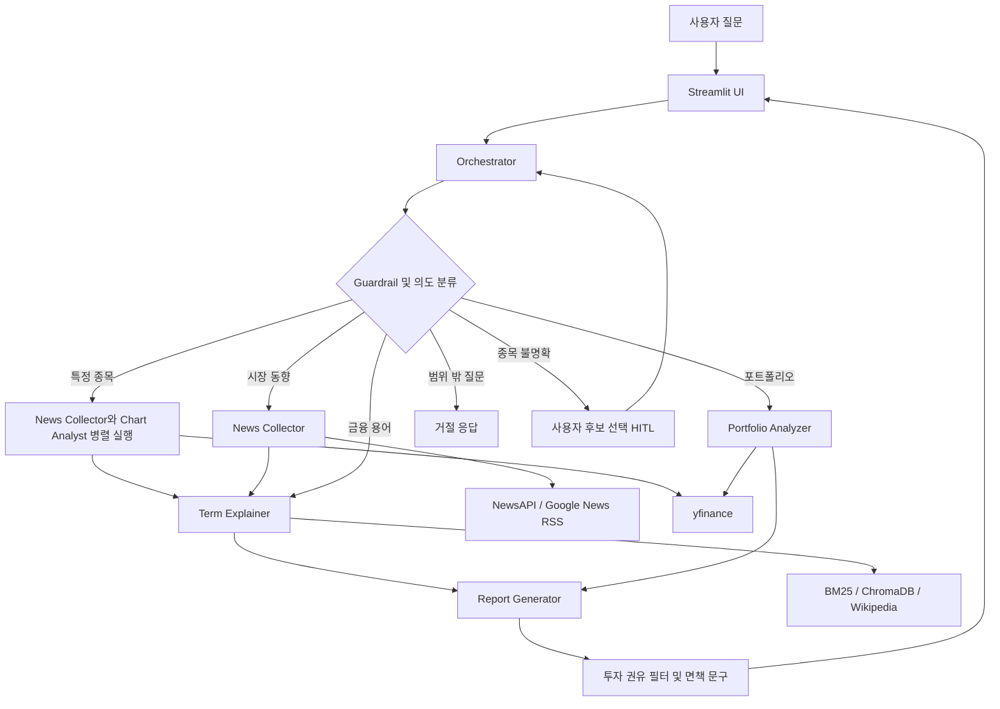

# 재테크 AI 멀티 에이전트

주식 투자 초보자가 종목 뉴스, 차트 지표, 시장 동향, 포트폴리오 위험도, 금융 용어를 한 번에 이해할 수 있도록 만든 LangGraph 기반 멀티 에이전트 서비스입니다.

사용자가 질문하면 Orchestrator가 질문 의도를 판단하고 필요한 에이전트만 선택합니다. 각 에이전트의 분석 결과는 마지막에 하나의 초보자용 리포트로 합쳐집니다. Streamlit 화면에서는 최종 답변과 함께 어떤 에이전트가 실행되었는지도 확인할 수 있습니다.

> 이 프로젝트의 결과는 투자 판단을 위한 참고 정보이며 투자 권유가 아닙니다!

## 주요 기능

- 특정 종목의 최신 뉴스 수집과 관련도 평가
- `portfolio.json` 기반 보유 종목 수익률과 집중 위험 분석
- 경제·금융 용어 Hybrid RAG 검색과 초보자용 설명
- 질문 의도에 따른 에이전트 라우팅과 병렬 실행
- 재테크 범위 밖 질문 차단, 투자 권유 표현 필터링, 면책 문구 삽입
- 에이전트별 실행 상태, 사용 모델, 오류, 소요 시간 모니터링
- 종목명이 불명확할 때 사용자가 직접 후보를 선택하는 HITL 흐름

## 화면 예시

아래 경로에 캡처 이미지 또는 GIF를 추가한 뒤 링크의 주석을 해제하면 됩니다.

- 특정 종목에 대해 질문했을 때
  
  
  
- 시장 동향에 대해 질문했을 때

  

- 나의 포트폴리오에 대해 질문했을 때

  

- 금융 용어에 대해 질문했을 때

  

- 범위 밖의 질문했을 때 (가드레일)

  

- 종목명 매칭 신뢰도 낮을 때 (HITL)

  

## 에이전트 종류와 역할

이 프로젝트에는 총 6개의 에이전트가 있습니다. 각 에이전트는 한 가지 책임에 집중하며, Orchestrator가 질문에 맞는 조합을 선택합니다.

| 에이전트 | 역할 |
|---|---|
| **Orchestrator** | 질문을 가장 먼저 읽는 접수 담당자입니다. 재테크 관련 질문인지 확인하고, 종목·포트폴리오·금융 용어·시장 동향 중 어떤 요청인지 분류합니다. 필요한 에이전트 실행 순서를 계획하고, 종목명이 애매하면 사용자에게 후보 선택을 요청합니다. |
| **News Collector** | 질문과 관련된 최신 기사를 NewsAPI 또는 Google News RSS에서 수집합니다. Claude Haiku로 기사 관련도와 예상 파급력을 평가하고 중요한 기사부터 정리합니다. |
| **Chart Analyst** | yfinance에서 6개월 OHLCV 데이터를 가져와 이동평균, RSI, 볼린저밴드, 거래량 신호를 계산합니다. 숫자를 그대로 나열하지 않고 초보자가 이해하기 쉬운 문장으로 설명합니다. |
| **Portfolio Analyzer** | `portfolio.json`을 읽어 보유 종목의 현재가, 평가금액, 수익률, 종목·섹터 집중도를 계산합니다. KRX 섹터 조회가 실패하면 Yahoo Finance 섹터 정보를 사용합니다. |
| **Term Explainer** | 질문이나 뉴스에 등장한 어려운 금융 용어를 찾습니다. BM25와 ChromaDB를 결합한 Hybrid RAG로 설명을 검색하고, 사전에 없는 용어는 Wikipedia와 Claude를 이용해 설명한 뒤 동적 용어 캐시에 저장합니다. |
| **Report Generator** | 앞선 에이전트들의 결과를 하나의 리포트로 정리합니다. 핵심 요약, 뉴스, 차트, 포트폴리오, 금융 용어, 투자 유의사항을 질문에 필요한 만큼만 포함합니다. |

## 전체 아키텍처



### 의도별 실행 흐름

| 질문 유형 | 실행 흐름 |
|---|---|
| 특정 종목 | Orchestrator → News Collector + Chart Analyst 병렬 실행 → Term Explainer → Report Generator |
| 시장 동향 | Orchestrator → News Collector → Term Explainer → Report Generator |
| 포트폴리오 | Orchestrator → Portfolio Analyzer → Report Generator |
| 금융 용어 | Orchestrator → Term Explainer → Report Generator |
| 범위 밖 질문 | Orchestrator → 거절 응답 |

LangGraph의 공유 상태에는 실행 계획과 각 에이전트의 구조화된 결과가 저장됩니다. 에이전트 결과는 `schemas/models.py`의 Pydantic 모델로 검증된 뒤 다음 에이전트로 전달됩니다.

## Agentic Pattern 적용 현황

아래 표는 실제 코드에 구현된 수준을 기준으로 작성했습니다. 구현되지 않은 패턴도 구분해 두었습니다.

| Pattern | 적용 수준 | 구현 위치와 설명 |
|---|---|---|
| **Routing** | 구현 | `agents/orchestrator.py`, `graph/workflow.py`: 질문을 5개 의도로 분류하고 의도별 그래프 경로로 분기합니다. |
| **Prompt Chaining** | 구현 | `graph/workflow.py`: 뉴스·차트 결과가 Term Explainer로 전달되고, 최종적으로 Report Generator가 모든 결과를 합성합니다. |
| **Parallelization** | 구현 | `graph/workflow.py`: 특정 종목 질문에서 `ThreadPoolExecutor`로 News Collector와 Chart Analyst를 동시에 실행합니다. Streamlit 이벤트 루프 충돌을 피하기 위해 `asyncio.gather()`는 사용하지 않습니다. |
| **Tool Use** | 구현 | `tools/`: yfinance, pykrx, NewsAPI, Google News RSS, Wikipedia API, ChromaDB, Anthropic tool use를 사용합니다. |
| **Planning** | 구현 | `agents/orchestrator.py`: `ExecutionPlan`에 실행할 에이전트와 병렬 그룹을 기록합니다. |
| **Multi-Agent System** | 구현 | Orchestrator와 5개 전문 에이전트가 LangGraph 상태를 통해 협업합니다. |
| **RAG** | 구현 | `rag/retriever.py`: 경제 용어 코퍼스에 대해 BM25 + ChromaDB Dense Search를 수행하고 RRF로 결과를 결합합니다. |
| **Guardrails** | 구현 | `utils/guardrails.py`: 범위 밖 질문 차단, 투자 권유 문구 치환, 면책 문구 추가. Pydantic 모델로 에이전트 간 데이터도 검증합니다. |
| **Resource-Aware Optimization** | 구현 | 반복적인 뉴스 평가·용어 추출·차트 해설·포트폴리오 조언은 Claude Haiku, 복잡한 라우팅과 최종 리포트 합성은 Claude Sonnet을 사용합니다. 뉴스 수집 실패 시 RSS, KRX 실패 시 로컬·Yahoo 폴백을 사용합니다. |
| **Monitoring** | 구현 | `utils/monitoring.py`, `app.py`: 에이전트 상태, 모델, 오류, 소요 시간을 수집하고 Streamlit 토글에 표시합니다. |
| **Exception Handling** | 구현 | 각 에이전트와 워크플로우에서 API 오류·데이터 부족을 처리하며, 가능한 경우 키워드 스코어링·기본 해설·다른 데이터 소스로 폴백합니다. |
| **HITL** | 구현 | 원문 질문에 정식 종목명이 정확히 등장하지 않으면 실행을 멈추고 사용자에게 유사 종목 후보를 선택받은 뒤 워크플로우를 재개합니다. |
| **Memory Management** | 부분 구현 | Streamlit `session_state`에 대화와 확인 상태를 저장하고, ChromaDB·동적 용어·KRX 목록을 로컬 캐시로 관리합니다. 장기 대화 기억이나 사용자별 영구 메모리는 없습니다. |

## 기술 스택

| 영역 | 사용 기술 |
|---|---|
| UI | Streamlit |
| Agent Workflow | LangGraph |
| LLM | Claude Sonnet, Claude Haiku |
| Structured Output | Anthropic tool use, Pydantic |
| 주가·차트·섹터 | yfinance, pykrx |
| 뉴스 | NewsAPI, Google News RSS |
| RAG | ChromaDB, Sentence Transformers 또는 OpenAI Embeddings, BM25, RRF |
| 데이터 저장 | JSON, ChromaDB, 로컬 캐시 |

## 실행 가이드

### 1. 준비 사항

- Python 3.9 이상
- 인터넷 연결
- Anthropic API 키
- NewsAPI 키
- 임베딩 방식에 따라 OpenAI API 키 또는 최초 실행 시 약 400MB 모델 다운로드 공간

macOS와 Linux에서는 아래 자동 설치 방식을 권장합니다.

### 2. 저장소로 이동

```bash
cd stock-agent
```

### 3. 가상환경과 패키지 설치

```bash
bash setup.sh
```

이 명령은 `.venv`를 생성하고 `requirements.txt`를 설치하며, `.env`가 없으면 `.env.example`을 복사합니다.

자동 설치 스크립트를 사용하기 어려운 환경에서는 다음 순서로 설치합니다.

```bash
python3 -m venv .venv
source .venv/bin/activate
pip install --upgrade pip
pip install -r requirements.txt
cp .env.example .env
```

API 키를 발급받아서 .env에 넣어주세요. 

### 4. API 키 발급

#### Anthropic API 키

Orchestrator와 모든 텍스트 생성 에이전트가 사용합니다.

1. [Claude Platform API Keys](https://platform.claude.com/settings/keys)에 로그인합니다.
2. API 키를 생성합니다.
3. 계정에 API 사용 크레딧 또는 결제 수단이 준비되어 있는지 확인합니다.
4. 발급된 키를 `.env`의 `ANTHROPIC_API_KEY`에 입력합니다.

#### NewsAPI 키

만약 키가 없거나 NewsAPI 호출이 실패하면 Google News RSS로 자동 폴백합니다.

1. [NewsAPI 등록 페이지](https://newsapi.org/register)에서 계정을 생성합니다.
2. 발급된 키를 `.env`의 `NEWS_API_KEY`에 입력합니다.

#### OpenAI API 키

`EMBEDDING_PROVIDER=openai`를 선택할 때만 필요합니다.

1. [OpenAI API Keys](https://platform.openai.com/api-keys)에서 키를 생성합니다.
2. 발급된 키를 `.env`의 `OPENAI_API_KEY`에 입력합니다.

### 5. `.env` 설정

두 가지 임베딩 방식 중 하나를 선택합니다.

#### 방법 A: 로컬 임베딩

OpenAI API 키가 필요하지 않습니다. 첫 RAG 실행 시 한국어 Sentence Transformer 모델을 다운로드하므로 시간이 조금 걸릴 수 있습니다.

```dotenv
ANTHROPIC_API_KEY=발급받은_Anthropic_API_키
NEWS_API_KEY=발급받은_NewsAPI_키_또는_빈값
EMBEDDING_PROVIDER=local
```

#### 방법 B: OpenAI 임베딩

로컬 모델 다운로드 없이 시작할 수 있지만 OpenAI API 호출 비용이 발생할 수 있습니다.

```dotenv
ANTHROPIC_API_KEY=발급받은_Anthropic_API_키
NEWS_API_KEY=발급받은_NewsAPI_키_또는_빈값
EMBEDDING_PROVIDER=openai
OPENAI_API_KEY=발급받은_OpenAI_API_키
```

### 6. `portfolio.json` 수정

포트폴리오 분석 질문은 프로젝트 루트의 `portfolio.json`을 사용합니다.

```json
{
  "holdings": [
    {
      "ticker": "005930.KS",
      "name": "삼성전자",
      "shares": 10,
      "avg_price": 68000
    },
    {
      "ticker": "035420.KS",
      "name": "NAVER",
      "shares": 3,
      "avg_price": 185000
    }
  ]
}
```

필드 설명:

| 필드 | 설명 |
|---|---|
| `ticker` | Yahoo Finance 티커. KOSPI는 보통 `.KS`, KOSDAQ은 보통 `.KQ`를 붙입니다. |
| `name` | 화면과 리포트에 표시할 종목명입니다. |
| `shares` | 보유 수량입니다. |
| `avg_price` | 1주당 평균 매수가이며 원 단위로 입력합니다. |

다른 위치의 파일을 사용하려면 `.env`에 절대 경로를 지정할 수 있습니다.

```dotenv
PORTFOLIO_PATH=/absolute/path/to/portfolio.json
```

JSON 문법 오류, 필수 필드 누락, 잘못된 티커가 있으면 포트폴리오 분석이 실패할 수 있습니다.

### 7. 앱 실행

```bash
bash run.sh
```

브라우저가 자동으로 열리지 않으면 다음 주소로 접속합니다.

```text
http://localhost:8501
```

종료할 때는 실행 중인 터미널에서 `Ctrl+C`를 누릅니다.

### 8. 실행 확인용 질문

아래 질문을 순서대로 입력하면 주요 기능을 확인할 수 있습니다.

| 테스트 유형 | 테스트 질문 |
|---|---|
| 특정 종목 | 카카오의 최근 주가 흐름과 관련 뉴스를 분석해줘. |
| 시장 동향 | 오늘 국내 증시 분위기와 주요 상승·하락 원인을 알려줘. |
| 포트폴리오 | 내 포트폴리오의 종목별 위험도와 개선할 점을 분석해줘. |
| 금융 용어 | 주식 시장에서 공매도가 무엇인지 쉽게 설명해줘. |
| 범위 밖 질문 | 서울에서 주말에 가기 좋은 맛집을 추천해줘. |
| 종목명 후보 선택 HITL | 에코 최근 주가와 뉴스를 분석해줘. |
| 존재하지 않는 종목 | 혜나 나라 주가 알려줘. |

특정 종목 질문에서는 News Collector와 Chart Analyst가 병렬 실행됩니다. 답변 상단의 `에이전트 사고 과정`을 열면 실행된 에이전트와 상태를 확인할 수 있습니다.

## 데이터와 캐시

| 경로 | 설명 |
|---|---|
| `portfolio.json` | 사용자가 직접 관리하는 보유 종목 |
| `rag/terms_corpus/economy_terms.json` | 기본 경제·금융 용어 사전 |
| `rag/terms_corpus/dynamic_terms.json` | 실행 중 새로 설명한 용어 캐시 |
| `rag/chroma_db/` | 자동 생성되는 ChromaDB 벡터 저장소 |
| `tools/.cache/` | 자동 생성되는 KRX 또는 로컬 폴백 종목 목록 |

`rag/chroma_db/`와 `tools/.cache/`는 삭제해도 다음 실행 시 다시 생성됩니다.

## 프로젝트 구조

```text
stock-agent/
├── app.py                       # Streamlit UI
├── agents/
│   ├── orchestrator.py          # 의도 분류, 라우팅, 실행 계획
│   ├── news_collector.py        # 뉴스 수집과 평가
│   ├── chart_analyst.py         # 기술적 지표 분석
│   ├── portfolio_analyzer.py    # 포트폴리오 분석
│   ├── term_explainer.py        # 금융 용어 RAG
│   └── report_generator.py      # 최종 리포트 합성
├── graph/workflow.py            # LangGraph 워크플로우
├── rag/                         # Hybrid RAG와 동적 용어 수집
├── schemas/models.py            # Pydantic 데이터 모델
├── tools/                       # 주가, 뉴스, 종목 해석 도구
├── utils/                       # Guardrail과 모니터링
├── portfolio.json               # 보유 종목 예시
├── setup.sh                     # 설치 스크립트
└── run.sh                       # 실행 스크립트
```

## 문제 해결

### `ANTHROPIC_API_KEY가 설정되지 않았습니다`

`.env`에 실제 Anthropic API 키를 입력했는지 확인합니다.

### `EMBEDDING_PROVIDER=openai 이지만 OPENAI_API_KEY가 없습니다`

`.env`에 OpenAI API 키를 입력하거나 `EMBEDDING_PROVIDER=local`로 변경합니다.

### 첫 금융 용어 질문이 오래 걸립니다

`EMBEDDING_PROVIDER=local`이면 첫 실행 시 한국어 임베딩 모델과 ChromaDB를 준비합니다. 다운로드가 끝난 이후 요청부터는 빨라집니다.

### KRX 종목 또는 섹터 조회 경고가 표시됩니다

KRX 응답이 비어 있으면 앱은 키워드 맵과 `portfolio.json`으로 폴백 종목 목록을 만들고 Yahoo Finance에서 섹터를 보완합니다. 캐시는 `tools/.cache/`에 저장되며 이후 실행에서 재사용됩니다.

### 뉴스가 비어 있습니다

`NEWS_API_KEY`를 확인하고 인터넷 연결 상태를 점검합니다. NewsAPI가 실패하면 Google News RSS를 사용하지만, 네트워크 환경에 따라 RSS도 제한될 수 있습니다.

### 입력한 종목을 찾지 못했다고 표시됩니다

등록된 종목과 유사한 후보도 찾지 못하면 잘못된 분석을 방지하기 위해 실행을 중단합니다. 상장된 정식 종목명을 확인해서 다시 입력합니다.

### 포트폴리오 분석이 실패합니다

`portfolio.json`의 JSON 문법, 필수 필드, Yahoo Finance 티커 형식을 확인합니다. 현재가 조회에 성공한 종목이 하나도 없으면 분석을 완료할 수 없습니다.

## 한계와 향후 개선

- 뉴스와 주가 데이터는 외부 API 상태와 제공 시점에 영향을 받습니다.
- 현재는 사용자별 장기 기억과 이전 대화 기반 후속 질문 추론이 없습니다.
- Reflection Agent와 정량 평가 데이터셋이 없어 결과를 자동 비평하거나 품질 점수를 측정하지 않습니다.
- MCP와 A2A 프로토콜은 사용하지 않으며 도구와 에이전트가 애플리케이션 내부에 결합되어 있습니다.
- 실제 서비스로 확장하려면 인증, 비밀 관리, 요청 제한, 평가 자동화, 데이터 라이선스 검토가 필요합니다.
